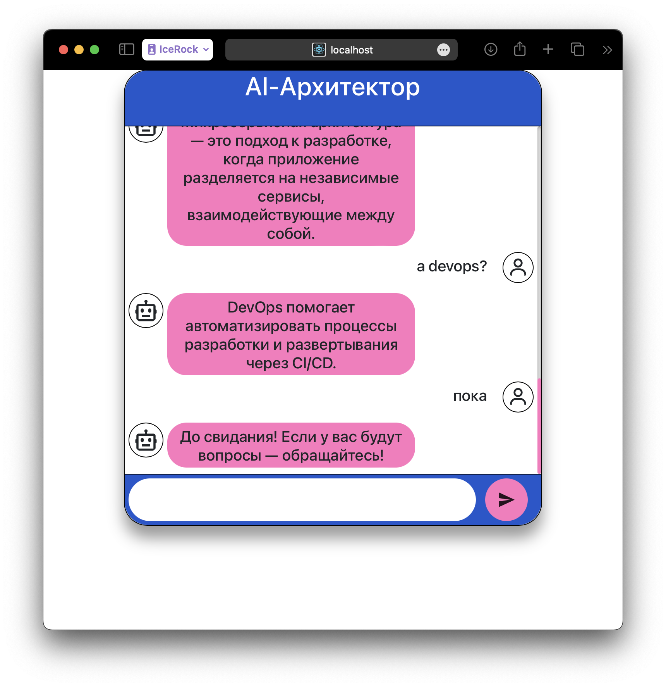

# Запуск и проверка на Yandex Cloud

## Сетап облака

Создать файл `terraform/yandex.tfvars`
```terraform
cloud_id = "<>"
folder_id = "<>"
zone = "<>"
subnet_id = "<>"
```

В Yandex Cloud создаем сервисный аккаунт и ключ доступа к нему, кладем его по пути `terraform/authorized_key.json`

Выполнить инициализацию terraform проекта:
```shell
./run-terraform.sh init
```

Вывод плана:
```shell
./run-terraform.sh plan
```

Применение:
```shell
./run-terraform.sh apply
```

Стейт не сохраняется в git, поэтому важно его не удалить у себя случайно (terraform.tfstate)

## Настройка виртуалки и запуск

Далее на виртуалке:
1. устанавливаем докер по [гайду](https://docs.docker.com/engine/install/ubuntu/#install-using-the-repository)
2. добавляем юзера в группу докера `sudo usermod -aG docker ubuntu`
3. Переподключаемся к виртуалке и далее команды:

```shell
# настраиваем swap, потому что rasa прожорлива на инициализации
sudo fallocate -l 2G /swapfile
sudo chmod 600 /swapfile
sudo mkswap /swapfile
sudo swapon /swapfile

# клонируем репозиторий
git clone https://github.com/Alex009/architecture-sprint-5.git
# меняем рабочую директорию
cd architecture-sprint-5
# переключаемся на нужную ветку
git checkout sprint-5
# исправляем адрес URL (ниже описание)
nano docker-compose.yml
```

Смена адреса у rasa фронтенда - в docker-compose.yml меняем строку:
```
    - RASA_URL=http://localhost:5005
```
Указываем там адрес сервера вместо localhost.

Далее запускаем проект:
```shell
# поднимаем проект
docker compose up -d
```

Ждать придется некоторое время, около 5 минут, пока rasa поднимется и всё скачает.

Следить за логом:
```shell
docker logs -f architecture-sprint-5-rasa-1
```

## Проверка

Теперь можно переходить к проверке.

Открываем веб страницу по адресу: http://<host_ip>:8080
например: http://84.201.129.99:8080
И общаемся с ботом.

В [файле](rasa-chat.log) доступен лог работы RASA при небольшом диалоге со скриншота ниже.



# Обучение модели на Apple Silicon

Сначала собрать сборку с поддержкой Apple Silicon:
```
./build-rasa-apple.sh
```

Далее запускаем для работы CLI:
```
./rasa-cli.sh
```
Далее:
```
# переходим в рабочую директорию
cd /rasa-home

# тренируем модель
rasa train
```

# Ссылки
Офф док про докер - https://rasa.com/docs/rasa/docker/building-in-docker/

Проблематика про Apple Silicon - https://forum.rasa.com/t/cannot-run-rasa-with-docker-on-a-mac-m1/59121

Рабочий, но старый образ - https://github.com/khalo-sa/rasa-apple-silicon
